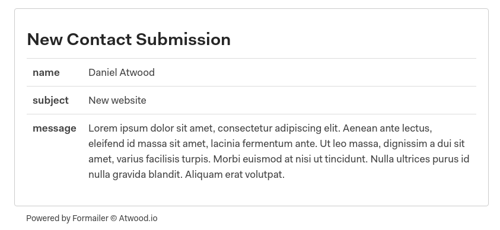

# Formailer



Netlify likes to pretend like no one uses Golang for functions. You can't even use `netlify dev` to test them. Well too bad, I like Go.

Netlify only gives you 100 free submissions per site a month. Most of the time my clients only use forms as a pseudo send email service. So why not take advantage of the 125k per site a month netlify function limit.

## How to use
Other Jamstack email services ask you to provide all the to, from, and subject information on every request. Which in my opinion kind of defeats the purpose of hiding your email in the first place. So we use Netlify Environment Variables. Unfortunately [functions can't read variables in `netlify.toml`](https://github.com/netlify/netlify-lambda/issues/59) so you'll have to add them all the the UI.

### SMTP
We use SMTP to send the emails. You'll need to add the following vars.
```env
SMTP_HOST="mail.domain.com"
SMTP_PORT="587"
SMTP_USER="noreply@domain.com"
SMTP_PASS="mysupersecretpassword"
```

### Forms
To support multiple forms on a single site, you have to prefix your form configs.
```env
FORM_form-name_TO=""
FORM_form-name_FROM=""
FORM_form-name_SUBJECT=""
```

Your setup might look like this:
```env
FORM_QUOTES_TO="support@domain.com"
FORM_QUOTES_FROM="noreply@domain.com"
FORM_QUOTES_SUBJECT="New Quote Request"

FORM_CONTACT_TO="info@domain.com"
FORM_CONTACT_FROM="noreply@domain.com"
FORM_CONTACT_SUBJECT="New Contact Submission"
```

### Submissions
Include a `_form_name` input in your form. And submit as JSON.
```html
<input name="_form_name" value="contact">
```

That's it!


## TODO
I do want to support more payloads formats than just JSON. And add some layer of spam protection. But as a proof of concept I think it works pretty well.
